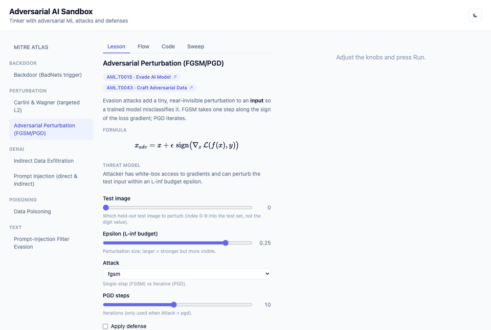

<div align="center">

# 🧪 Adversarial AI Sandbox

**Break a model, then defend it — in your browser.**

An interactive teaching sandbox for adversarial machine learning. Pick an attack, read a
guided lesson (real math + the actual source code), tune the knobs, run it, and watch the
model fail — then flip on the paired defense and watch what it can (and *can't*) fix.

*Every attack ships with its defense — because attacks are only half the story.*




<sub>Flip a digit with FGSM → stream the backdoor defense trade-off curve → bend a decision boundary with poisoned data → watch a real local LLM get hijacked → see it all mapped to MITRE ATLAS.</sub>

</div>

## Why this exists

Adversarial ML is usually taught as slides and equations. This sandbox makes it *hands-on*:
you can see a one-pixel-budget perturbation flip a digit's label, a poisoned blob bend a
decision boundary, or a prompt-injection string get past a naive filter — and then try the
defense yourself. It's built to answer "okay, but does the defense actually work?" — and
**two of the defenses have deliberate, visible limits**, because in the real world they do too.

## The six attacks (each with a paired defense)

| Attack | What you do | Paired defense | MITRE ATLAS |
|---|---|---|---|
| **Data Poisoning** (2D sklearn) | Flip labels & inject a poison blob to bend the boundary | Super-majority label cleaning | [AML.T0020](https://atlas.mitre.org/techniques/AML.T0020) Poison Training Data |
| **Adversarial Perturbation** (FGSM/PGD, MNIST) | Add a tiny L∞ perturbation to fool the classifier | Adversarial training | [AML.T0015](https://atlas.mitre.org/techniques/AML.T0015) · [AML.T0043](https://atlas.mitre.org/techniques/AML.T0043) |
| **Carlini & Wagner** (targeted L2, MNIST) | Optimize a minimal perturbation to a *chosen* target class | Adversarial training | [AML.T0015](https://atlas.mitre.org/techniques/AML.T0015) · [AML.T0043](https://atlas.mitre.org/techniques/AML.T0043) |
| **Backdoor** (BadNets trigger, MNIST) | Plant a trigger→target rule at training time | Fine-pruning | [AML.T0018](https://atlas.mitre.org/techniques/AML.T0018) Manipulate AI Model |
| **Prompt Injection** (local Qwen2.5-1.5B) | Hijack a summarizer directly or via a poisoned RAG doc | Spotlighting / delimiting *(only partial)* | [AML.T0051](https://atlas.mitre.org/techniques/AML.T0051) LLM Prompt Injection |
| **Prompt-Injection Filter Evasion** (TF-IDF) | Slip an injection past a keyword filter — 7 techniques | Input normalization *(can't undo them all)* | [AML.T0015](https://atlas.mitre.org/techniques/AML.T0015) Evade AI Model |

Adding a new attack is **one backend module file with zero frontend changes** — the UI is
driven entirely by each attack's schema (its knobs, lesson, formula, code, and result type).

## Quickstart (Docker)

```bash
docker compose up --build
```

Then open **http://localhost:5173** (the API runs on http://localhost:8000).

On the **first run**, the backend downloads MNIST and trains the model checkpoints (~5 min)
into a persistent `mnist-models` volume, then serves. Every start after that reuses the
checkpoints and is fast — image rebuilds don't retrain. First run needs network access.

Stop with `docker compose down` (keeps the checkpoints); `docker compose down -v` also removes
the volume and forces a retrain next time.

Running locally for development: see [`backend/README.md`](backend/README.md) and
[`frontend/README.md`](frontend/README.md).

## What's in the UI

- **Lesson · Flow · Code · Sweep** tabs per attack — the guided explainer, an actor-color-coded
  step diagram, the real source snippets (highlighted), and a live parameter-sweep chart that
  overlays the defended curve on the attacked one.
- **MITRE ATLAS** coverage matrix — every attack mapped to its real-world technique and tactic.
- **Interactive decision-boundary explorer** for poisoning (pure-SVG, morph clean⇄poisoned⇄sanitized).
- **Light / dark** theme throughout.

## Tech

- **Backend:** FastAPI · scikit-learn · PyTorch · 🤗 transformers (a real, key-free local LLM) — `backend/`
- **Frontend:** React · TypeScript · Vite · Tailwind · KaTeX · highlight.js — `frontend/`
- **Tests:** 127 backend (pytest) · 65 frontend (vitest)

## Design & findings

Architecture, per-attack notes, and the empirical findings — including the two
"defenses have limits" results — are in [`docs/PROJECT_NOTES.md`](docs/PROJECT_NOTES.md).

## Homage

This one's a tip of the hat to a **summer course on adversarial AI at Purdue** (CNIT 573 ·
TECH 57300, *"Adversarial Techniques in AI"*) — an attempt to turn the ideas from that class
into something you can actually poke at. A personal project, built with appreciation for the
course; not affiliated with or endorsed by the university.

## License

[MIT](LICENSE) — free and open source. Do what you like; attribution appreciated.
